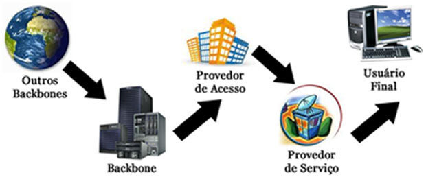

  
  
  **HTML(Hyper Text Markup Language)** é a linguagem de marcação padrão para páginas da web. Com HTML, você pode criar seu próprio site. Foi criado por Tim Berners-Lee(físico britânico) em 1989.
    
O HTML consiste em uma série de elementos. Os elementos HTML informam ao navegador como exibir o conteúdo. Os
  elementos identificam partes de conteúdo como "este é um título", "este é um parágrafo", "este é um link" etc. Alguns elementos HTML não têm conteúdo. Esses elementos são chamados de elementos vazios. Elementos vazios não possuem uma tag de finalização.

    
HTML passou por várias versões e atualmente está na versão 5.2(HTML5), houve mudança da linguagem de marcação simples HTML para HTML5(contendo novas tag´s etc), isso ocorreu por volta do ano de 2014.

           

  **CSS(Cascading Style Sheets)** é uma linguagem que descreve o estilo de um documento HTML. De forma com estilo, o CSS descreve como os elementos HTML devem ser exibidos. 
    
Ele pode controlar o layout de várias páginas da web de uma só vez. Foi desenvolvida em 1996, pela World Wide Web 
Consortium (W3C), que é a principal organização de padronização da World Wide Web. CSS é usado para definir estilos para suas páginas da Web, incluindo o design, layout e variações de exibição para diferentes dispositivos e tamanhos de tela. As definições de estilo são normalmente salvas em arquivos .css externos.

           

  <h1>Frameworks</h1>  Frameworks é um conjunto de códigos abstratos e/ou genéricos que unem códigos com recursos iguais, ou seja, está ligado à arquitetura do seu software. Alguns frameworks atualmente usados pelos desenvolvedores: Spring(Java), Bootstrap(CSS), Angular(JavaScript), Pure(CSS e Html).

  <h1>Bibliotecas</h1> Bibliotecas(lib) é compartilhar soluções por meio de funções ou métodos. Uma das grandes vantagens da criação de bibliotecas é que você pode utilizá-las em diferentes projetos. Algumas bibliotecas atualmente usadas no mercado: jQuery, Angular, React, Hint(Css). 

           

 
<h1>Como funciona a internet</h1>

  
A Internet é a espinha dorsal da Web, a infraestrutura técnica que faz a Web possível. Mas basicamente, a Internet é
uma gigantesca rede de computadores que se comunicam juntos.

  
A história da internet começa nos anos 60 como um projeto de pesquisa consolidado pelo exército norte americano,
e tornou-se uma infraestrutura pública nos anos 80 com o suporte dado por diversas universidades públicas e companias privadas. As várias tecnologias que suportam a internet se acoplaram através do tempo, mas a forma de funcionamento não mudou muito: **Internet é uma forma de conectar computadores e garantir, em qualquer situação, que eles encontrem uma forma de se manter conectados**.

   
Alguns conceitos inportantes para que funcione a internet: **backbones** são pontos das redes que compõem o núcleo
das redes de Internet. São pontos-chave da Internet que distribuem pelas redes as informações baseadas na tecnologia TCP/IP. Existem poucos backbones espalhados pelo mundo;Os **provedores de acesso** são, em geral, empresas ligadas ao setor de telecomunicações, ou até mesmo as próprias companhias telefônicas, que fornecem o acesso à Internet por meio de planos acordados com seus usuários; Estes dados de Internet que trafegarão na rede necessitam de um meio para o seu transporte até os usuários, e são as empresas **provedoras de serviço** as responsáveis por este papel. Estas empresas recebem os dados do provedor de acesso e distribuem aos usuários por variados meios, seja por linha telefônica, fibra ótica ou via rádio (por tecnologia sem fio); Este pode parecer o passo final do caminho percorrido pela Internet, mas na verdade não é. Ao chegar no **usuário final** o sinal de Internet passa a repetir todo o caminho novamente, porém na forma inversa, já que você, como usuário final, também envia sinais - com as suas requisições - para a Internet. Os dados enviados pelos usuários são transportados pelo provedor de serviço, enviados para o provedor de acesso e chegam novamente ao backbone.

 
       
 
      